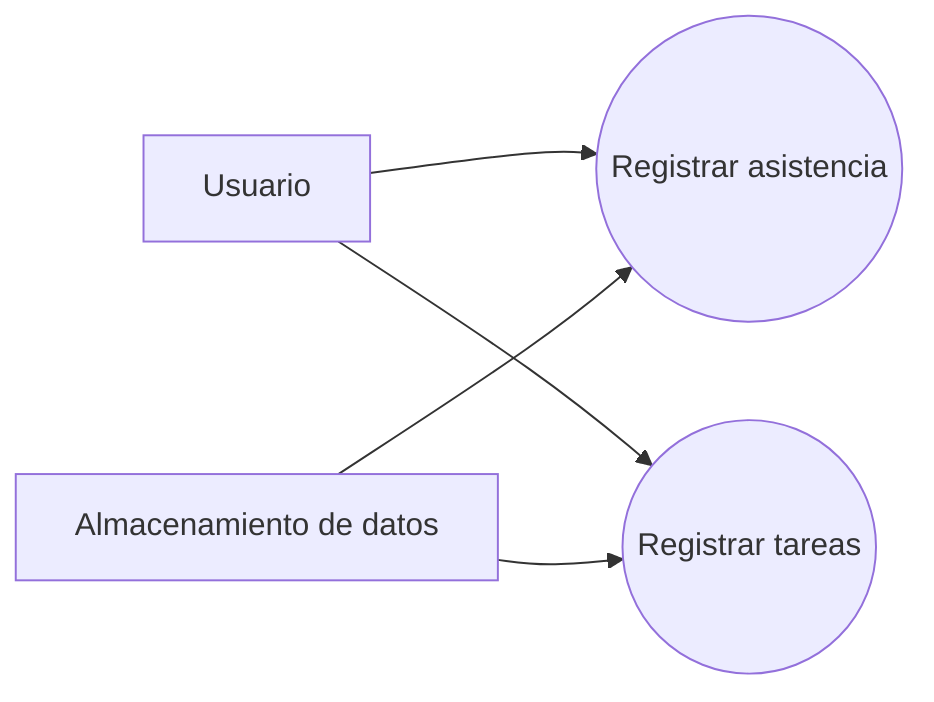
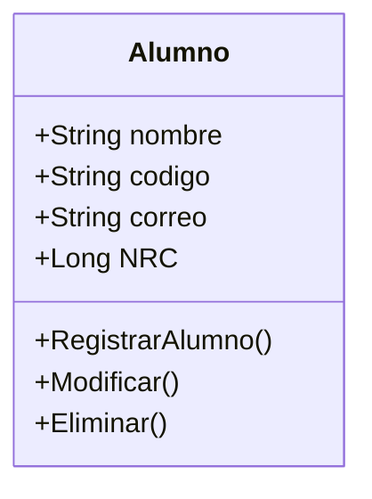
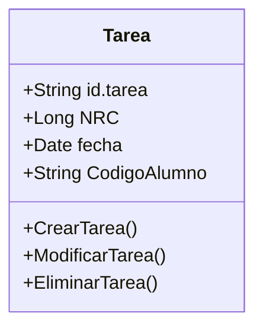

# Ejemplo codigo UML

```mermaid
flowchart LR
  U[Usuario] --> UC1(("Registrar asistencia"))
  DB[Almacenamiento de datos] --> UC1
  U --> UC2(("Registrar tareas"))
  DB --> UC2
```

## Clase Alumno

```mermaid
classDiagram
  class Alumno {
    +String nombre
    +String codigo
    +String correo
    +Long NRC
    +RegistrarAlumno()
    +Modificar()
    +Eliminar()
  }
```

## Clase Tarea

```mermaid
classDiagram
  class Tarea {
    +String id.tarea
    +Long NRC
    +Date fecha
    +String CodigoAlumno
    +CrearTarea()
    +ModificarTarea()
    +EliminarTarea()
  }
```
